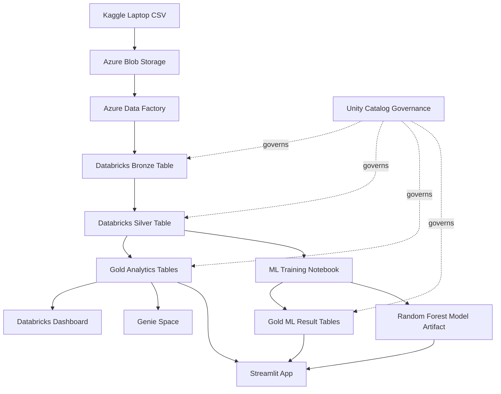
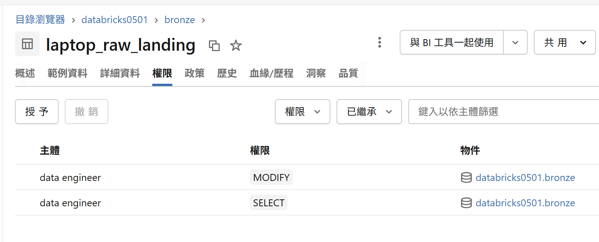
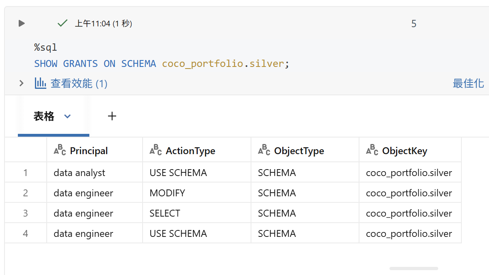
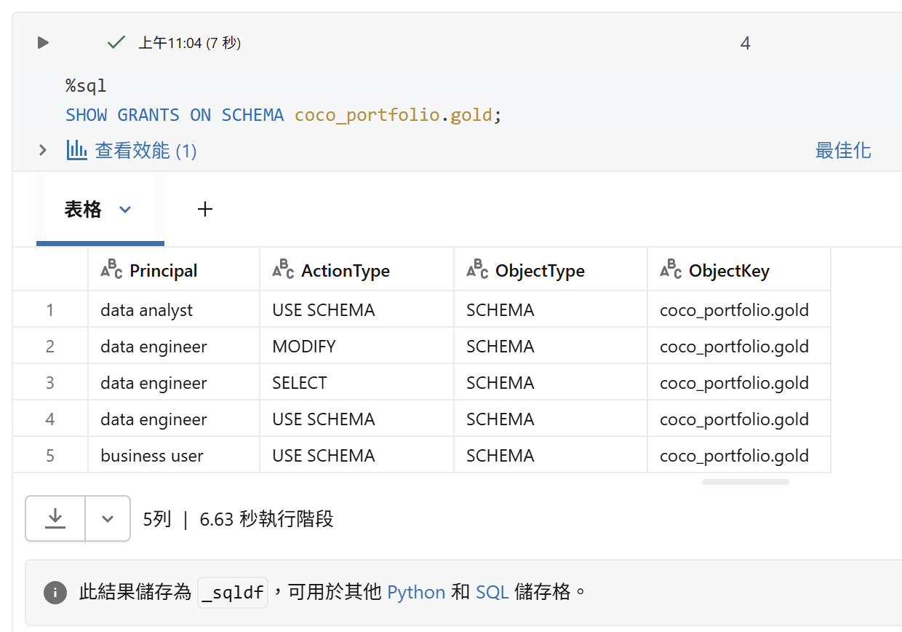
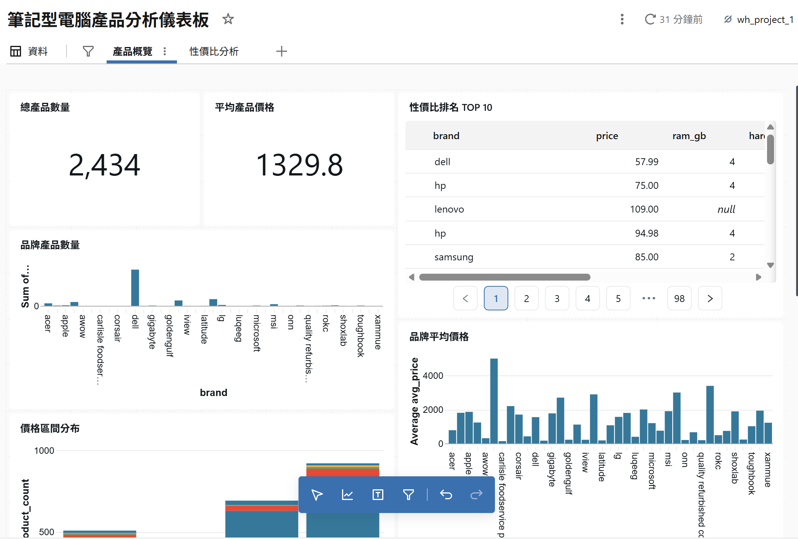
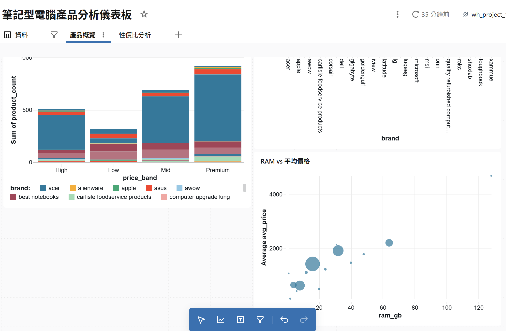
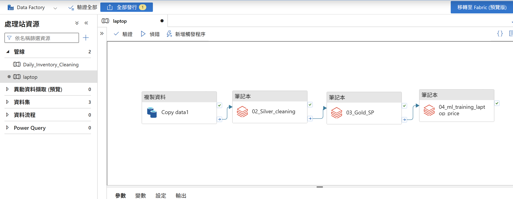
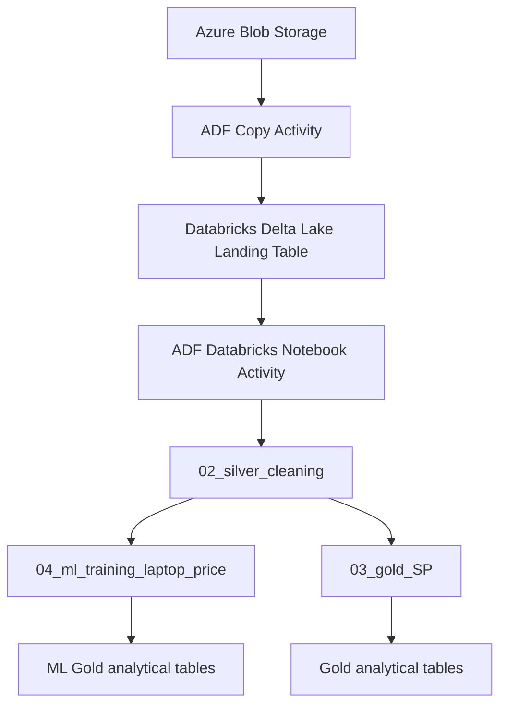
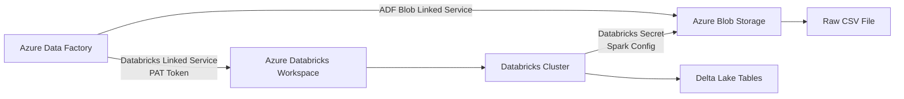

## 基於 Azure Lakehouse 的筆電價格分析與預測平台

本專案以筆電產品資料為主題，建立一個基於 **Azure Databricks Lakehouse** 的資料工程與分析作品集。專案重點不只是完成資料分析，而是將原始 CSV 資料轉換為可治理、可重複執行、可供商業分析使用的資料管線。  

**筆電價格智能分析平台網址:** https://azure-databricks-laptop-price-lakehouse-4vshivqfgfzfabzvfdqqqj.streamlit.app/

**英文介面:** https://azure-databricks-laptop-price-lakehouse-jvjazgmq6xxzz7swkvh43g.streamlit.app/

目前已完成：
- 使用 Databricks 建立 Bronze / Silver / Gold Medallion Architecture
- 使用 PySpark 進行資料清理與轉換
- 使用 Delta Tables 儲存 Bronze、Silver、Gold 層資料
- 使用 Unity Catalog 設計資料治理與權限控管
- 建立 Gold Layer 分析表，支援後續 Databricks Dashboard
- 規劃 ADF orchestration 與 ML 分析延伸
- 創建 Steamlit App畫面


## 1. 專案目標
本專案模擬企業資料平台中的資料處理流程，將原始筆電商品資料整理成可供分析與決策使用的資料產品。
本專案展示如何使用 Azure Blob Storage、ADF、Azure Databricks、Unity Catalog、ML training notebook 與 Streamlit，建立一個從資料攝取、資料治理、Gold analytics、模型訓練到互動式價格模擬器的端到端 Lakehouse data product。

主要目標包括：

1. 建立 Azure Databricks Lakehouse 架構
2. 實作 Bronze / Silver / Gold 資料分層
3. 將原始 CSV 轉換成乾淨且可分析的 Delta Tables
4. 建立 Gold Layer 商業分析表
5. 使用 Unity Catalog 管理資料權限
6. 為後續 ML 分析與互動式預測介面建立基礎
7. 產出Streamlit產品介面

## 2. 專案架構 (Project Architecture)



## 3.目前完成進度:
| 模組                       | 狀態        | 說明                                         |
| ------------------------ | --------- | -------------------------------------------------- |
| Azure Blob Storage       | 已完成       | 作為 raw CSV landing zone           |
| Azure Data Factory       | 已完成       | 串接 Blob、Databricks notebooks 與 pipeline execution |
| Bronze Layer             | 已完成       | 建立 raw landing / Bronze Delta table    |
| Silver Layer             | 已完成       | 完成價格、RAM、Storage、品牌與螢幕尺寸清理  |
| Gold Analytics Layer     | 已完成       | 建立品牌價格、價格帶、規格分析、CP 值排行   |
| Unity Catalog Governance | 已完成       | 設計 Data Engineer / Analyst / Business User 權限模型 |
| Databricks Dashboard     | 已完成       | 使用 Gold tables 建立內部 BI dashboard   |
| ML Layer                 | 已完成       | 訓練 Random Forest，產出模型評估、特徵重要性、品牌溢價與 what-if tables |
| Streamlit App            | 已完成       | 建立外部展示型互動式價格模擬器  |
| Deployment               | 已完成       | 第一版規劃使用 Streamlit Community Cloud  |

## 4. 核心商業問題定義 

| 問題                            | 分析類型                     | 對應資料層 / 方法   |
| ----------------------------- | ------------------------ | ---------------------------------- |
| Q1：不同品牌的產品主要集中在哪些價格帶？         | EDA / 現況分析               | Gold: `price_band_summary` |
| Q2：哪些硬體規格最容易推升產品價格？           | ML / Feature Importance  | ML Analysis / Gold ML Results |
| Q3：在相似規格條件下，哪些品牌仍可維持較高售價？     | Residual Analysis / 品牌溢價 | ML Analysis / Gold ML Results |
| Q4：若調整 RAM、SSD 等規格，產品價格帶是否改變？ | What-if Prediction       | ML Analysis / Future Streamlit App |
| Q5：哪些產品具有較高 CP 值？             | KPI / Ranking            | Gold: `cp_value_ranking`  |

## 5. Medallion Architecture 設計

本專案採用 Bronze / Silver / Gold 資料分層設計。

| 層級           | 目的                             | 產出                                     |
| ------------ | ------------------------------ | -------------------------------------- |
| Landing Zone | 儲存原始 CSV 檔案                    | Unity Catalog Volume                   |
| Bronze       | 保留原始資料結構，加入 ingestion metadata | `bronze.laptop_raw`     |
| Silver       | 清理、標準化與轉型資料                    | `silver.laptop_cleaned` |
| Gold         | 建立可直接用於分析與 dashboard 的資料產品     | 多張 Gold analytical tables              |


### 5.1 Bronze Layer
Bronze Layer 的目標是保留原始資料，避免在第一層進行過度清洗，以確保資料可追溯。

主要處理內容：

從 Unity Catalog Volume 讀取原始 CSV
將原始資料轉換為 Delta Table
保留原始欄位
加入資料來源與 ingestion timestamp 等 metadata  
輸出表：
bronze.laptop_raw
### 5.2 Silver Layer
Silver Layer 的目標是將 Bronze 原始資料轉換成乾淨、可重複使用的分析資料。

主要清理項目：

欄位名稱標準化
price 去除貨幣符號與逗號，轉換為數值型態
ram 轉換為 GB 數值
harddisk 將 TB / GB 統一轉換為 GB
screen_size 轉換為數值型態
處理缺失值
移除重複資料
加入 Silver 更新時間

輸出表：
silver.laptop_cleaned
### 5.3 Gold Layer
Gold Layer 的目標是建立可直接用於商業分析、Dashboard 與後續 ML 分析的資料產品。

目前建立的 Gold Tables：
Gold Table	用途  
brand_price_summary	分析各品牌平均價格、最低價格、最高價格與產品數量  
price_band_summary	分析不同品牌在 Low / Mid / High / Premium 價格帶的分布  
spec_price_summary	分析 RAM、儲存容量與平均價格的關係  
cp_value_ranking	根據價格與評分 / 規格建立 CP 值排行

**cp_value_ranking補充:**
第一版 CP score 我先用 rating / price，代表評分相對價格的效率。但我發現這會偏向低價、低規格產品，因此我進一步設計 spec-adjusted CP score，把 rating、RAM、storage 納入綜合價值分數，再除以價格。這樣可以避免便宜但規格過低的產品被排到太前面，也比較符合使用者在選購筆電時對性價比的直覺。
spec_score =
rating_num * 0.4
+ normalized_ram_score * 0.3
+ normalized_storage_score * 0.3

cp_score = spec_score / price：算出 每花 1 元，可以買到多少規格價值

### 5.4 權限治理 Unity Catalog
我在 Databricks 裡用 Unity Catalog 做資料治理。依照 Bronze、Silver、Gold 分層。Bronze 放原始資料，Silver 放清理後資料，Gold 放商業分析表。

權限上我設計三種角色：Data Engineer 可以讀寫 Bronze、Silver、Gold，因為他要維護整條資料管線；Data Analyst 可以讀 Silver 和 Gold，但不能改資料；Business User 只能讀 Gold，避免直接接觸原始資料或半成品資料。

在 Unity Catalog 裡，USE SCHEMA 只是進入 schema 的權限，SELECT 才是讀資料，MODIFY 則是修改資料。這樣可以把資料工程、分析和商業使用情境分開，符合企業資料治理的基本做法。

Catalog：coco_portfolio  
Schema：bronze / silver / gold / ml  
Table：各層資料表  

| Group           | Bronze | Silver | Gold |
| --------------- | ------ | ------ | ---- |
| `data_engineer` | 可讀寫    | 可讀寫    | 可讀寫  |
| `data_analyst`  | 無權限     | 可讀     | 可讀   |
| `business_user` | 無權限     | 無權限     | 可讀   |






## 6 Databricks Dashboard

本專案使用 Databricks SQL Dashboard 作為第一版資料展示層。

Dashboard 規劃包含：

**Average Laptop Price by Brand**  
顯示不同品牌的平均價格差異。  
**Price Band Distribution by Brand**  
分析各品牌產品集中在哪些價格帶。  
**Average Price by RAM and Storage**  
觀察 RAM、儲存容量與平均價格的初步關係。  
**Top CP Value Laptops**  
展示具有較高 CP 值的產品。  

第一版選擇 Databricks Dashboard，是因為 Gold Tables 已經儲存在 Databricks Delta Lake 中，能直接以 SQL 查詢並視覺化，不需要額外建立前端服務。





## 7 ADF Pipeline
本專案使用 Azure Data Factory 作為資料管線，負責將 Azure Blob Storage 中的原始 CSV 檔案匯入 Databricks，並在資料落地後依序觸發 Databricks notebooks 完成 Silver 與 Gold layer 的資料轉換。

ADF 在本專案中不是單純的資料搬移工具，而是負責串接不同 Azure 服務之間的資料流、執行順序與錯誤監控。整體流程如下：



### 7.1 ADF 在本專案中的角色

ADF 主要負責三件事：

從 Azure Blob Storage 讀取原始 CSV
將資料寫入 Databricks Delta Lake landing table
串接後續 Databricks notebooks，讓資料自動完成 Silver 與 Gold layer 轉換

Pipeline 中的主要 activities 包含：
| Activity           | Type                         | Purpose                                           |
| ------------------ | ---------------------------- | ------------------------------------------------- |
| Copy data1         | Copy Activity                | 將 Blob CSV 匯入 Databricks Delta Lake landing table |
| 02_silver_cleaning | Databricks Notebook Activity | 清理、標準化與型別轉換資料                                     |
| 03_gold_SP         | Databricks Notebook Activity | 產生 Gold analytical tables                         |
| 04_ml_training_laptop_price | Databricks Notebook Activity | 產生ML gold table跟pkl檔案    |





### 7.2 ADF Linked Service 設計

ADF 要連接外部服務時，需要透過 Linked Service 定義連線方式。本專案主要使用兩個 Linked Services：

| Linked Service           | Target             | Purpose                                 |
| ------------------------ | ------------------ | --------------------------------------- |
| AzureBlobStorage1        | Azure Blob Storage | 讀取原始 laptop CSV 檔案                      |
| AzureDatabricksDeltaLake | Azure Databricks   | 將資料寫入 Delta Lake 並觸發 Databricks compute |




其中，Blob linked service 用來處理 ADF 到 Azure Blob Storage 的連線；Databricks linked service 則用來讓 ADF 呼叫 Databricks cluster，並在 cluster 上建立 execution context 來執行 Delta Lake 寫入。

需要注意的是，ADF 能讀 Blob，並不代表 Databricks cluster 也能讀 Blob。ADF 與 Databricks 是兩個不同的服務，各自需要自己的權限與認證方式。

### 7.3 Databricks PAT Token 與 Command Execution 權限

ADF 要呼叫 Databricks cluster 時，需要使用 Databricks Personal Access Token（PAT）作為 API 認證。這個 token 不只需要能登入 Databricks workspace，還需要具備足夠的 scope 讓 ADF 可以在 cluster 上建立 execution context。

在實作過程中，曾遇到以下錯誤：
Failed to send request to Azure Databricks Cluster.
Operation: CreateContext.
進一步透過 Databricks CLI 測試後，確認原因是 PAT token 缺少：command-execution

ADF 的 Azure Databricks Delta Lake connector 需要在 cluster 上建立 command execution context，因此 token scope 需要包含：  
workspace,
compute / clusters,
jobs,
secrets,
command-execution
這個問題讓我理解到，在雲端服務串接中，「可以登入」不代表「可以執行」。權限會被拆成很多層，因此，在建立 ADF 與 Databricks 的連線時，需要同時確認：

Databricks workspace URL
Cluster ID
PAT token scope
Cluster permission
Notebook 路徑
Linked service 設定

### 7.4 Databricks Secret 與 Storage Account Key 管理

本專案的原始資料放在 Azure Blob Storage，因此 Databricks cluster 需要具備讀取該 Storage Account 的權限。

為了避免將 Storage Account Key 直接寫在 notebook 或 GitHub 中，本專案使用 Databricks Secrets 管理敏感資訊。實作方式如下：

建立 Databricks Secret Scope
將 Azure Storage Account Key 存入 secret
在 Databricks cluster 的 Spark Config 中引用該 secret
Databricks notebook 透過 cluster 設定安全讀取 Blob Storage

**這樣做的好處包括：**

Storage Account Key 不會直接出現在 notebook 程式碼中
機密資訊不會被 commit 到 GitHub
Cluster 可以安全地讀取 Azure Blob Storage
未來如果需要 key rotation，只需要更新 secret，不需要修改 pipeline code


### 7.5 後續改進方向

目前本專案已完成 Azure Blob Storage、ADF、Azure Databricks、Delta Lake、Unity Catalog 與 ML Notebook 的端到端串接。若要進一步接近企業級 production pipeline，後續可以從安全性、治理、監控與自動化幾個方向強化。


| 未來改進方向                                                           | 目的      | 預期效益                                             |
| -------------------------------------------------------------- | ------------------------------------------------- | ------------------------------------------------ |
| 改用 ADLS Gen2 作為正式 Data Lake     | 使用更適合大數據分析的 data lake storage    | 支援 hierarchical namespace、權限控管與更完整的 lakehouse 架構 |
| 使用 Managed Identity 或 Service Principal 取代 Storage Account Key | 避免直接管理長期有效的 storage key    | 提升安全性，降低 key 洩漏與 rotation 成本    |
| 使用 Azure Key Vault 管理 secret        | 將機密集中管理 | 更符合企業級 secret management 與 audit 需求  |
| 設定 Unity Catalog External Location  | 讓 Unity Catalog 正式管理外部 storage path               | 強化資料治理、權限控管與資料資產管理 |
| 加入 data quality report   | 監控 row count、null rate、schema drift、duplicate 等問題 | 提升 pipeline 可靠性，讓資料異常更容易被發現  |
| 加入 ADF schedule trigger    | 讓 pipeline 可定期自動執行   | 從手動 pipeline 進一步變成自動化資料流程  |


## 8. ML Layer：Laptop Price Prediction

本專案在 Silver layer 後加入 ML layer，使用清理後的資料訓練筆電價格預測模型。ML 的目標不是單純追求最高準確率，而是展示如何將 Databricks Lakehouse 中的乾淨資料進一步轉換為可解釋、可應用的模型結果，並提供給後續 Dashboard 與 Streamlit App 使用。

### 8.1 模型資料來源

ML 訓練資料來自：

`databricks0501.silver.laptop_cleaned`

Silver table 已完成價格、RAM、儲存容量、品牌與螢幕尺寸等欄位的清理與標準化，因此適合作為模型訓練資料來源。

模型使用的主要欄位如下：

| 類型 | 欄位 | 說明 |
|---|---|---|
| Numerical Features | `ram_gb` | RAM 容量，單位為 GB |
| Numerical Features | `harddisk_gb` | 儲存容量，單位為 GB |
| Numerical Features | `screen_size` | 螢幕尺寸 |
| Categorical Feature | `brand` | 筆電品牌 |
| Target | `price` | 筆電價格 |

### 8.2 模型設計

本專案使用 `Linear Regression` 作為 baseline model，並使用 `Random Forest Regressor` 作為主要模型。

模型流程包含：

1. 從 Silver table 讀取清理後資料  
2. 選取 `brand`、`ram_gb`、`harddisk_gb`、`screen_size` 作為模型輸入  
3. 使用 `price` 作為預測目標  
4. 對數值欄位進行缺失值補值與標準化  
5. 對品牌欄位進行 One-Hot Encoding  
6. 比較 Linear Regression 與 Random Forest 的 validation performance  
7. 將模型結果寫回 Gold ML tables  
8. 將訓練完成的 Random Forest pipeline 存成 `.pkl` artifact，供 Streamlit 使用  

### 8.3 ML Gold Tables

ML notebook 會產出以下 Gold ML tables：

| Table | 說明 |
|---|---|
| `model_evaluation_metrics` | 比較 Linear Regression 與 Random Forest 的 MAE、RMSE、R² |
| `feature_importance_summary` | 顯示 Random Forest 中影響價格預測的重要特徵 |
| `brand_premium_residual` | 分析在相似規格條件下，各品牌實際價格與模型預測價格的差異 |
| `what_if_prediction_results` | 建立固定規格升級情境，模擬不同品牌與硬體規格下的預測價格變化 |

### 8.4 Brand Premium Residual

除了直接預測價格，本專案也設計了品牌溢價分析。方法是建立一個不包含 `brand` 欄位的模型，只根據 RAM、Storage 和 Screen Size 預測價格，再比較實際價格與預測價格的差異。

計算邏輯如下：

`residual = actual_price - predicted_price`

若 residual 為正，代表該品牌在相似規格下的實際售價高於模型預測值，可能具有較高品牌溢價；若 residual 為負，則代表該品牌在相似規格下價格相對較低。

這個分析可以幫助回答：

> 在硬體規格相近的情況下，哪些品牌仍能維持較高售價？

### 8.5 Model Artifact

訓練完成後，本專案將 Random Forest pipeline 儲存為模型檔案：

`laptop_price_rf_model.pkl`

同時也儲存模型需要的欄位資訊：

`model_features.pkl`

這兩個檔案會提供給 Streamlit App 使用，讓使用者可以在前端輸入品牌、RAM、儲存容量與螢幕尺寸，即時取得模型預測價格。


## 9. Streamlit App：External-facing Data Product Demo

本專案除了在 Databricks Dashboard 中建立內部 BI 報表，也另外建立 Streamlit App 作為外部展示型 data product demo。

Databricks Dashboard 主要用來展示 Gold layer 的固定分析結果，適合企業內部 business users 查看品牌價格、價格帶分布、規格價格分析與 CP 值排行。Streamlit App 則是將 Databricks 產出的 Gold tables 與 Random Forest model artifact 包裝成一個可操作的互動式介面，讓使用者不需要進入 Databricks，也可以直接透過網頁查看分析結果與操作模型。

### 9.1 Streamlit App 的定位

Streamlit App 並不是用來取代 Databricks Dashboard，而是作為一個更接近外部使用者或面試官可以操作的產品介面。

| 工具 | 定位 | 使用情境 |
|---|---|---|
| Databricks Dashboard | 內部 BI 報表 | 查看固定 Gold table 分析結果 |
| Genie Space | 自然語言資料探索 | 透過問題探索 Gold tables |
| Streamlit App | 外部展示型 data product | 操作互動式價格模擬器與模型結果 |

### 9.2 Streamlit App 使用的資料

第一版 Streamlit App 採用低成本且穩定的部署方式，沒有直接連線 Databricks，而是讀取從 Databricks 匯出的 Gold CSV outputs 與模型 artifact。

資料流如下：

```text
Databricks Gold Tables
    ↓ export as CSV
streamlit_app/data/

Databricks Trained Model
    ↓ export as .pkl
streamlit_app/models/

Streamlit App
    ↓
Market Analytics + ML Insights + Price Simulator

```

##  10. 後續改進方向說明

本專案目前已完成 Azure Blob Storage、ADF、Databricks、Delta Lake 與 Unity Catalog 的端到端串接。後續若要進一步接近企業級 production pipeline，可以從安全性、治理、監控與自動化幾個方向強化。例如，將 Blob Storage 升級為 ADLS Gen2 作為正式 Data Lake，並使用 Managed Identity 或 Service Principal 取代 Storage Account Key，以降低金鑰外洩與人工維護風險；同時可導入 Azure Key Vault 與 Unity Catalog External Location，集中管理機密與外部資料位置。在資料品質與營運面，則可以加入 data quality report 與 ADF schedule trigger，讓 pipeline 不只可以手動執行，也能定期自動化運行並監控資料品質。
